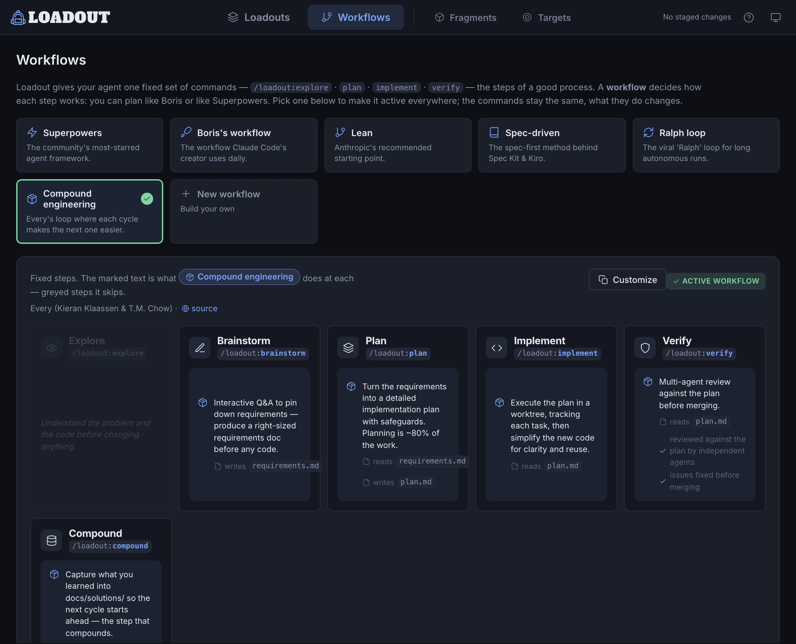

<h1>
  
</h1>

*Equip the right context for the job.*

[](https://github.com/elleryfamilia/loadout/releases)
[](https://github.com/elleryfamilia/loadout/actions/workflows/ci.yml)
[](LICENSE)

**Different work needs different context. Stop handing your agent the same one every time.**

A *loadout* is the kit you equip before a job. Loadout (the tool) bundles your AI coding context into named kits and equips the right one automatically — whether you're in a Rust repo, a Next.js app, or on a bare server with no repo at all.

- Your project's `AGENTS.md` describes **the repo.**
- Loadout carries **what you bring to it** — your conventions, your tooling, your voice — across every project, machine, and agent.

Works with **Claude, Codex, Gemini, opencode, and Copilot**. Loadout delivers your context as a local, gitignored file each agent reads — without touching committed project instruction files.

<p align="center">
  
</p>
<p align="center"><sub><i><code>load studio</code> — assemble reusable context kits from your fragment library.</i></sub></p>

---

## Quick start

Install the prebuilt binary — no Rust toolchain needed:

```bash
curl -LsSf https://github.com/elleryfamilia/loadout/releases/latest/download/loadout-installer.sh | sh
```

Open the local UI and build your first kit:

```bash
load studio
```

Then equip it and launch your agent in one command:

```bash
load claude
```

More install options — source builds, self-updating — under [Install](#install).

---

## How it works

Loadout detects what you're working in, picks the loadout whose targets match, renders its fragments into a local gitignored file — the **overlay** — and wires that into your agent.

```bash
$ load explain

Project
  base   : ~/code/my-rust-app
  branch : main

Detected targets: [rust]

Loadout selection → rust

Active fragments
  • rust-conventions
  • terse-comms

Write plan
  claude:
    created  .loadout/generated/claude.md
    updated  CLAUDE.local.md
```

Selection is deterministic and inspectable — no LLM decides it. The agent only ever sees the finished overlay. Then launch:

```bash
load claude
```

Loadout re-renders the overlay, wires it into Claude, and starts `claude`. The repo gains no committed Loadout content: overlays, bindings, logs, and managed local files are all gitignored.

<p align="center">
  
</p>

---

## The model

Three things you author, one rule for putting them together. Full detail in [docs/concepts.md](docs/concepts.md).

**Fragments** — reusable units of guidance or context. Static text, or dynamic output from a built-in provider or shell command.

```toml
[[fragments]]
id = "rust-conventions"
guidance = "Build with cargo, lint with clippy; prefer ?/Result over unwrap()."

[[fragments]]
id = "terse-comms"
guidance = "Be terse: lead with the result and what changed; skip preamble."
```

**Loadouts** — named kits of fragments, tied to one or more targets. A loadout is the unit of selection: when its targets match, its fragment list is what gets rendered.

```toml
[[loadouts]]
name = "rust"
targets = ["rust"]
fragments = ["rust-conventions", "terse-comms"]
```

**Targets** — the coarse project or environment types Loadout detects: `rust`, `node`, `bun`, `nextjs`, `go`, `python`, `java`, `ruby`, `php`, `swift`, `dotnet`, and `machine` (used when you're not inside a repo — handy for sysadmin and DevOps work).

### The rule

Loadout equips exactly one loadout per context. Loadouts don't merge or stack — composition happens *inside* the chosen one, through its fragment list.

```text
no loadout's targets match  →  a no-targets default applies, else empty
exactly one loadout matches →  use it automatically
multiple loadouts match     →  ask once, then remember the choice for this project
```

---

## Workflows

A loadout carries your *context*. A **workflow** carries your *process* — the way you like to work, across every agent. Loadout exposes one fixed set of five slash commands — `/loadout:explore`, `brainstorm`, `plan`, `implement`, `verify` — and the workflow your loadout equips decides what each step *means*. "Plan like Boris" and "plan spec-first" are the same `/loadout:plan`, carrying different instructions.

<p align="center">
  
</p>
<p align="center"><sub><i><code>load studio</code> — pick a house process, or build your own; each fills the same five-command spine.</i></sub></p>

Six ship — Anthropic's lean loop, how Boris works, Superpowers, spec-driven, the Ralph loop, and Every's compound engineering — or build your own in `load studio`. A stage can hand a file to the next step (plan writes `plan.md`, implement reads it), which is what makes a workflow more than headings. Equip one on a loadout — in studio's **Workflow slot**, or by hand:

```toml
[[loadouts]]
name = "machine"      # the default (no-targets) loadout → applies everywhere
workflow = "lean"
```

Workflows are global-only and never enforced — guidance rendered into each agent, not a runtime. Full detail in [docs/concepts.md](docs/concepts.md#workflows-implemented).

---

## Supported agents

Loadout produces one overlay and delivers it the way each agent expects.

| Agent      | Loadout writes                                                            | Default wiring                                                  |
| ---------- | ------------------------------------------------------------------------ | -------------------------------------------------------------- |
| `claude`   | `.loadout/generated/claude.md`                                            | Adds a managed import block to `CLAUDE.local.md`               |
| `codex`    | `.loadout/generated/agents.md`                                            | Merges into gitignored `AGENTS.override.md`                    |
| `gemini`   | `.loadout/generated/gemini.md`                                            | Wires through gitignored `GEMINI.local.md` and Gemini settings |
| `opencode` | `.loadout/generated/opencode.md`                                          | Registers the overlay in global opencode instructions          |
| `copilot`  | `.loadout/generated/copilot/.github/instructions/loadout.instructions.md` | Launches Copilot CLI with the custom instructions directory    |
| `generic`  | `.loadout/generated/generic.md`                                           | Emit-only; you wire it yourself                                 |

It never edits committed shared files like `AGENTS.md`, `CLAUDE.md`, `GEMINI.md`, or `.github/copilot-instructions.md` — only local, gitignored paths.

---

## `load studio`

`load studio` opens a localhost-only web UI for your fragment and loadout library. It's a visual editor over your TOML config — not a hidden database. Nothing touches disk until you review and apply the staged diff.

```bash
load studio
```

Use it to create and edit fragments, compose loadouts, assign them to targets, browse and build [workflows](#workflows), preview generated overlays, run dynamic fragment previews, and review diffs before applying. On first launch it detects your current context and can scaffold a starter kit from the detected target.

---

## Sync across machines

Fragments and loadouts are global-only, so sharing them is just syncing your global config.

```bash
load sync init                                          # start a config repo
load sync init git@github.com:you/loadout-config.git    # or wire an existing one
load sync clone https://github.com/you/loadout-config.git   # on another machine
```

After that, launching an agent (`load claude`) pulls the latest config before rendering. Your private `local.toml` (hostnames, host classes, machine-specific values) stays local and never syncs.

---

## Already have a `CLAUDE.md` or `AGENTS.md`?

Don't hand-translate it. Loadout ships an agent skill, [`loadout-migrate`](skills/loadout-migrate/SKILL.md), that reads your existing global agent instructions and turns them into Loadout fragments plus the loadouts you need. Your originals are left untouched.

```bash
load skill install
```

Then, in an agent session, run `/loadout-migrate` or just ask *"Import my CLAUDE.md into Loadout."*

Two more ship: [`loadout-remember`](skills/loadout-remember/SKILL.md) saves a durable cross-project preference as a fragment when you mention one mid-session — instead of leaving it stranded in one agent's memory — and [`loadout-import-workflow`](skills/loadout-import-workflow/SKILL.md) turns another repo's command/skill suite into a loadout [workflow](#workflows). The skills follow the cross-agent `SKILL.md` format, so the same install works in Claude Code, Codex, Gemini, and opencode.

---

## Where things live

You author fragments and loadouts once, globally. A repo never stores them — it only remembers which loadout to use.

```text
~/.config/loadout/config.toml   # your library — public/shareable
~/.config/loadout/local.toml    # private, gitignored: hostnames, host classes, machine values
.loadout/                       # per-repo, gitignored: overlays, binding, logs, cache
```

A read-only **palette** of starter fragments also ships inside the binary; duplicate one into your library to own and edit it. Repos don't store global fragments or loadouts — if one does, `load doctor` flags it. More in [docs/configuration.md](docs/configuration.md).

---

## Commands

| Command                                      | What it does                                                          |
| -------------------------------------------- | -------------------------------------------------------------------- |
| `load <agent> [args…]`                       | Equip the matching loadout and launch the agent (e.g. `load claude`) |
| `load use <loadout>`                         | Pin this project to a loadout (remembers the choice)                 |
| `load list [fragments\|agents\|targets]`     | List loadouts (default), fragments, agents, or targets               |
| `load edit [name]`                           | Open your config in `$EDITOR`                                        |
| `load studio`                                | Launch the local web UI                                              |
| `load explain [--agent <id>\|all]`           | Show detected context, selected loadout, and write plan             |
| `load refresh [--agent <id>\|all]`           | Render or re-render overlays without launching                      |
| `load clean [--agent <id>\|all]`             | Remove generated overlays and managed blocks                        |
| `load detect [--probes]`                     | Print detected context and optional provider data                   |
| `load doctor`                                | Diagnose config, agents, overlays, and safety issues                |
| `load sync [init [url]\|clone <url>]`        | Sync global config across machines                                  |
| `load skill [install\|remove\|status]`       | Manage embedded agent skills                                        |
| `load update [--check]`                      | Self-update installer-based installs                                |

Run `load --help` for the full set and global flags (`--cwd`, `--verbose`, `--dry-run`).

---

## Safety

Generated overlays are agent guidance, not enforced policy — they're regular files an agent reads. Loadout keeps them clean and local: allowlisted env vars only, secret-name denylisting and token redaction, atomic writes, gitignored artifacts, managed marker blocks, context hashes, and `--dry-run` previews. Run `load doctor` to check your setup. Full threat model in [docs/security.md](docs/security.md).

---

## Install

Prebuilt binary — no Rust toolchain needed (macOS and Linux; on Windows use WSL):

```bash
curl -LsSf https://github.com/elleryfamilia/loadout/releases/latest/download/loadout-installer.sh | sh
```

Installer-based installs update in place with `load update`. From source:

```bash
cargo install --git https://github.com/elleryfamilia/loadout
```

---

## Documentation

Full docs live in [`docs/`](docs/):

- [Concepts](docs/concepts.md) — the model, selection, providers, freshness
- [Configuration](docs/configuration.md) — config layers, templates, dynamic fragments
- [Security & trust](docs/security.md)
- [Architecture](docs/architecture.md) · [Extending](docs/extending.md) · [Testing](docs/testing.md)

---

## License

Licensed under the [MIT License](LICENSE). Unless you state otherwise, any contribution you submit shall be licensed as above, without additional terms.
