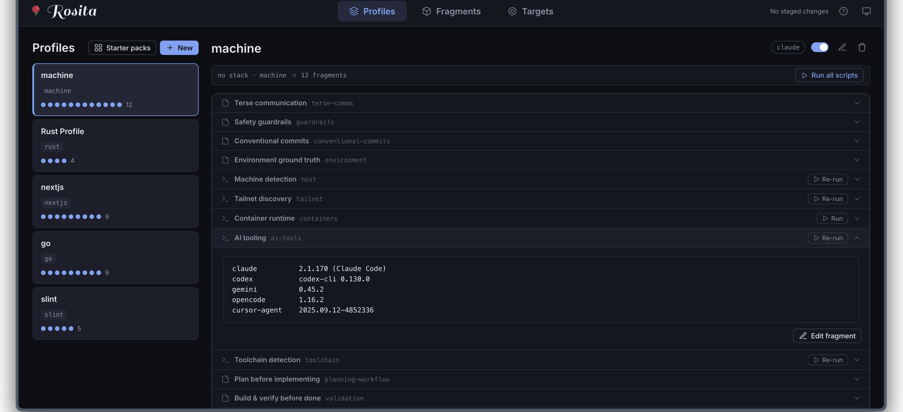
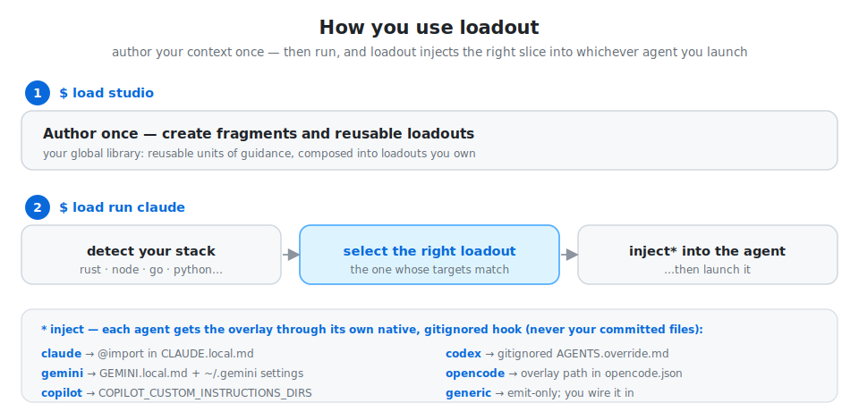
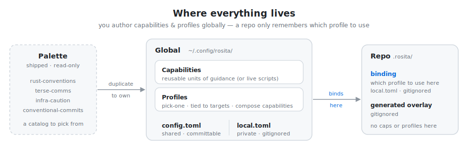

##  Rosita — Composable global context for AI coding agents

Author reusable guidance once, globally — conventions, preferences, safety rules —
and `rosita` delivers it into whichever agent you use (Claude, Codex, Gemini,
opencode, Copilot) without touching your committed files. It picks the guidance
that fits each project, so you're not pasting the same `CLAUDE.md` into every repo
and every tool.

<p align="center">
  
</p>
<p align="center"><sub><i><code>rosita studio</code> — composing a profile from your fragment library.</i></sub></p>

<p align="center">
  
</p>

<p align="center"><sub><i>* how the overlay reaches each agent is detailed in <a href="#agents--one-overlay-n-deliveries">Agents — one overlay, N deliveries</a>.</i></sub></p>

> ⚠️ Generated overlays are **agent guidance, not enforced policy.** They are
> regular files an agent reads; nothing here is a security control. The only real
> safety boundary is the environment-variable allowlist (see [Safety](#safety)).

---

## Quick start

**1. Install** — prebuilt binary, no Rust toolchain needed (macOS + Linux):

```bash
curl -LsSf https://github.com/elleryfamilia/rosita/releases/latest/download/rosita-installer.sh | sh
```

Or from source: `cargo install --git https://github.com/elleryfamilia/rosita`.

Installed this way, `rosita update` self-updates to the latest release (and
`rosita run` quietly notes when one is available). Source installs update with
`cargo install --git … --force` instead.

**2. Author your context** — reusable fragments and profiles, in a local web UI:

```bash
rosita studio
```

**3. Run your agent** in any project, with the matching context injected:

```bash
rosita run claude
```

**4. Use it everywhere** — publish your config once, pull it on any other machine:

```bash
rosita sync init                 # on this machine: git-back your config + push
```
```bash
rosita sync clone https://github.com/you/rosita-config.git   # on a headless box
```

After that it's automatic — `rosita run` pulls the latest first. See
[Sync across machines](#sync-across-machines) for details.

## The model in 60 seconds

rosita has **three** things you author, and one rule for putting them together.

- **Fragments** — reusable atoms of guidance: *"Rust conventions"*,
  *"be terse"*, *"be careful with infrastructure"*, or a live script like
  *"here are my running containers"*. You keep a **library** of your own, and
  there's a shipped read-only **palette** to duplicate starters from.
- **Profiles** — a named bundle of fragments, tied to one or more **targets**
  (the coarse thing rosita detects: `rust`, `node`, `nextjs`, `go`, `python`,
  `java`, `ruby`, `php`, `swift`, `dotnet`, or `machine` when you're not in a
  repo).
- **The binding** — when more than one profile could apply, rosita asks **once**
  which to use and remembers your answer for that project.

**The rule — one profile per context.** rosita detects the context, finds the
profiles whose `targets` match, and selects **exactly one** (or none). Profiles
do **not** merge or stack; composition happens *inside* the chosen profile, over
its fragment list. That's the whole trick: no priority math, no union of
half-a-dozen matching rules — just *this repo looks like rust → use the rust
profile → render its fragments.*

```
no profile's targets match  →  a no-targets "default" profile applies, else empty
exactly one matches          →  use it, no prompt
two or more match            →  you pick once; the choice is remembered (the binding)
```

A profile that declares **no `targets`** is the catch-all **default** — it
applies wherever nothing more specific matches (keep two and you pick between
them, like any other tie).

Selection is fully deterministic and inspectable (`rosita explain` shows what was
detected, which profiles matched, and which one is bound). **No LLM is involved
in selection** — the agent only ever consumes the finished overlay.

## A worked example

```bash
# 1. Author a profile once, globally (here via the visual editor; see `rosita studio`).
#    Say: a "rust" profile, targets = [rust], composing rust-conventions + terse-comms.

# 2. cd into any Rust repo and ask what rosita sees:
$ rosita explain
Project
  base   : ~/code/my-rust-app
  branch : main

Detected targets: [rust]
Profile selection → rust          # 1 match → auto-selected, no prompt

Active fragments
  • rust-conventions
  • terse-comms

Write plan
  claude:
    created  .rosita/generated/claude.md
    updated  CLAUDE.local.md       # managed @import block → the overlay

# 3. Render the overlay and wire it into the agent's file:
$ rosita render --agent claude
claude  ·  profile rust  ·  sha256:a1fb087e1a81…
  created       .rosita/generated/claude.md
  created       CLAUDE.local.md        (@import block → the overlay)
  created       .gitignore             (ignores the generated/ overlay)

# 4. Or do both and launch the agent in one step:
$ rosita run claude            # render, then exec `claude` (args passed through)
```

The repo itself gains no committed rosita content — only a gitignored overlay and
(if you had to pick between profiles) a gitignored note of which one you chose.

## Where everything lives

You author fragments and profiles **once, globally**. A repo never stores them
— it only remembers *which profile to use here*.

<p align="center">
  
</p>

- **Global** (`~/.config/rosita/`) holds your whole library — fragments *and*
  profiles. It splits into a **public** `config.toml` (shareable, commit it to a
  dotfiles repo to sync across machines) and a **private** `local.toml`
  (gitignored — real hostnames, `[host_classes]`, secret-adjacent params).
- **The palette** is shipped inside the binary, read-only. You *duplicate* a
  starter from it into your library to own and edit it; it is never auto-composed.
- **A repo** (`.rosita/`) carries only the **binding** (`local.toml`,
  gitignored) and the generated overlay (gitignored). Fragments and profiles
  declared in a repo are ignored — `rosita doctor` flags them and points you at
  the global config.

## `rosita studio` — the visual way

```bash
rosita studio            # opens a local web UI at 127.0.0.1:7777; Ctrl-C to quit
```

Studio is an **ephemeral, localhost-only** web UI for managing your library —
run the command, it starts a server and opens your browser; close it and it's
gone. It's a **lens over your TOML**, never a hidden store: every edit is shown
as the exact file diff before you **Apply**, and it writes clean,
comment-preserving TOML you could have hand-written.

- **Fragments** — a content-first editor for static guidance or scripts (with
  syntax highlighting and on-demand "run this script" preview).
- **Profiles** — a composer: name, targets, and a fragment picker, with a
  **live overlay preview** that updates as you edit.
- **Stage → diff → apply** — nothing touches disk until you review the per-file
  diff (against the raw bytes on disk) and apply.
- **First launch** — on a fresh config, studio greets you, shows what it
  detected, and offers a **quick start**: a starter profile pre-filled from the
  detected target plus a few palette fragments, all staged for you to tweak.

Hand-edit a config file and studio reflects it; everything stays git-diffable and
yours. Studio never executes a fragment during preview — editing is
side-effect-free until you Apply.

## Install

**Prebuilt binary** (no Rust toolchain needed) — fetches the latest
[GitHub Release](https://github.com/elleryfamilia/rosita/releases):

```bash
curl -LsSf https://github.com/elleryfamilia/rosita/releases/latest/download/rosita-installer.sh | sh
```

Builds are published for macOS (Apple Silicon + Intel) and Linux (x86_64 +
ARM64). The installer drops `rosita` on your `PATH`; from then on `rosita update`
self-updates in place. Windows isn't built yet (rosita is unix-only today); use
WSL there.

**From source** — requires a stable Rust toolchain (1.85+) and the `git` CLI
(used for repo detection; no libgit2 build dependency):

```bash
cargo install --git https://github.com/elleryfamilia/rosita
```

That builds and installs the `rosita` binary straight from the repo — no clone
needed. For local development instead:

```bash
git clone https://github.com/elleryfamilia/rosita && cd rosita
cargo install --path .       # or: cargo build --release  → ./target/release/rosita
```

## Sync across machines

Because fragments and profiles are **global-only**, sharing them across
machines is just syncing one file — `config.toml`. rosita git-backs your config
dir and keeps it current automatically, so your laptop's library is there on every
headless box (a VPS, Proxmox, a container).

**Set it up once**, on the machine you author from:

```bash
rosita sync init        # or: rosita sync init git@github.com:you/rosita-config.git
```

This makes your config dir a git repo and scaffolds a `.gitignore` so `local.toml`
(your per-machine hostnames / secret-adjacent params) **never syncs**. If you pass
a URL it wires it as the remote and pushes; if you don't and `gh` is installed, it
**offers to create the GitHub repo for you** — you pick the name (default
`rosita-config`) and public vs. private — then pushes.

**Onboard a headless box** — install, then pull your config:

```bash
rosita sync clone https://github.com/you/rosita-config.git
```

That's the whole setup: `rosita run claude` there now composes your laptop-authored
profiles. A fresh per-machine `local.toml` is created for the box's own specifics.

**Then it's automatic.** Editing in studio commits + pushes on Apply; `rosita run`
pulls the latest first — throttled, timeout-bounded, and **never blocking** (offline
just uses the last-synced config):

```text
  ⟳ sync    pulled 2 changes · rosita-config  1.3s
  ✓ render  rust → claude · sha256:a1fb087…
  ▸ launch  claude
```

`rosita sync` forces a pull + push by hand. Auto-pull/push default on but stay
inert until you `sync init`; tune them under `[sync]` (see
[configuration](docs/configuration.md#sync-implemented)).

> **Public or private repo?** `config.toml` is secret-free by design (the leak-lint
> guarantees it), so the config repo can be **public** — then onboarding a box
> needs no git auth at all. Keep it private if you prefer; either way your secrets
> live only in the per-machine `local.toml`, which never syncs.

## Already have a `CLAUDE.md` / `AGENTS.md`?

Don't hand-translate it. rosita ships an **agent skill**,
[`rosita-migrate`](skills/rosita-migrate/SKILL.md), that reads your existing
global agent instructions and turns them into rosita fragments plus the few
profiles you actually need — additively (your originals are left untouched).
It follows the cross-agent Agent Skills format (`SKILL.md`), so the same
install works in Claude Code, Codex CLI, Gemini CLI, and opencode.

```bash
rosita skill install
# then, in any agent session:  /rosita-migrate   (or "import my CLAUDE.md into rosita")
```

The skill is embedded in the binary — no repo checkout needed. It installs to
`~/.agents/skills/` (read natively by Gemini CLI and opencode) with symlinks
into `~/.claude/skills/` and `~/.codex/skills/` for agents that scan their own
dotdir — created only when that agent's directory already exists. The first
interactive `rosita run` also offers it (once) while your config has no
profiles yet; `rosita skill remove` uninstalls and stops the offer, and
`rosita doctor` reports the install's health. If you edit the installed files,
rosita stops touching them.

## Commands

| Command | What it does |
| --- | --- |
| `rosita studio [--port N] [--no-open]` | Launch the local web UI to view/edit fragments & profiles. |
| `rosita sync [init [url] \| clone <url>]` | Sync your global config across machines (git-backed); bare `sync` pulls + pushes. See [Sync across machines](#sync-across-machines). |
| `rosita detect [--json] [--probes]` | Detect and print the current context; `--probes` also runs environment providers (host/toolchain/ai-tools/tailnet/docker). |
| `rosita explain [--agent <id>\|all] [--json]` | Show what was detected, which profiles matched their `targets`, the selected one, and the write plan. |
| `rosita render [--agent <id>\|all] [--override\|--no-override] [--force]` | Render the overlay(s) for the selected profile and wire them up. |
| `rosita run <id> [args…] [--skip-render] [--override\|--no-override]` | Render for a launchable agent, then exec it (args passed through). |
| `rosita refresh [--agent <id>\|all] [--override\|--no-override] [--force]` | Re-render already-initialized overlays (no-op if context unchanged). |
| `rosita clean [--agent <id>\|all]` | Remove rosita-generated overlays + managed blocks (never touches committed files). |
| `rosita doctor` | Diagnose environment, config, agents, templates, overlay freshness, public-config leaks, and repo-declared fragments/profiles. |
| `rosita fragments [list\|show <id>] [--json]` | List your fragment library (active ones marked), or show one in detail. |
| `rosita profiles [--json]` | List your profiles with their `targets`, marking which match and which is selected. |
| `rosita agents [--json]` | List configured agents and how each delivers the overlay. |
| `rosita skill [install\|remove\|status] [id]` | Manage the embedded agent skills under `~/.agents/skills` (bare `skill` shows status). |
| `rosita update [--check]` | Self-update to the latest release (installer-based installs); `--check` only reports availability. |

`<id>` is an agent id — built-ins are `claude`, `codex`, `gemini`, `opencode`,
`copilot`, `generic` (plus any you add via `[[agents]]`). `--agent` defaults to
the configured default agent.

**Global flags:** `--cwd <DIR>` (operate as if run from there), `--verbose`,
`--dry-run` (write nothing; show what would change).

## What gets detected

`rosita detect` exposes: cwd, git root/branch/remotes (credential-sanitized)/
worktree flag, repo name, languages (by extension), stack (Rust, Next.js, Node,
Go, Python…), package manager (cargo, pnpm, yarn, npm, bun, uv, poetry, pip…),
discovered build/test/lint/run commands, OS/arch/hostname/user, the parent
process (caller), and an **allowlisted, redacted** subset of environment
variables. The coarse **stack** is what profile `targets` match against.

## Configuration

Fragments and profiles are **global-only**. They live in:

- `~/.config/rosita/config.toml` — **public / shareable** (honors
  `$XDG_CONFIG_HOME`, and `$ROSITA_CONFIG_DIR` for tests/isolation).
- `~/.config/rosita/local.toml` — **private / gitignored**: real hostnames,
  `[host_classes]` globs, and `[fragment_params.<id>]` values. Layered *after*
  `config.toml`, so it wins. `rosita doctor` flags machine-specific literals that
  belong here.

A repo's `.rosita/` directory holds only the per-project **binding**
(`local.toml`, gitignored), the generated overlays (`generated/`, gitignored),
the audit log (`logs/events.jsonl`), the probe cache (`cache/`), and any template
overrides (`templates/`). Sharing your library across machines is just committing
`config.toml` to a synced repo — the public/private split *is* the sync boundary.

See [`examples/config.toml`](examples/config.toml) and
[`examples/local.toml`](examples/local.toml) for annotated configs.

### Fragments & profiles

A **fragment** is a reusable unit of guidance. A **profile** ties a set of
fragments to one or more detected **targets** and is the unit of selection.
Within the selected profile, its fragments are composed: deduped by id,
`requires`-resolved (dependencies first), each fragment's own `when` self-gate
applied, and `params` merged (fragment default ← profile-supplied ← private
`[fragment_params]`).

```toml
[[fragments]]
id = "rust-conventions"
guidance = "Build with cargo, lint with clippy; prefer ?/Result over unwrap()."

[[fragments]]
id = "terse-comms"
guidance = "Be terse: lead with the result and what changed; skip preamble."

[[profiles]]
name = "rust"
targets = ["rust"]                       # matches when the repo detects as rust
fragments = ["rust-conventions", "terse-comms"]
```

- **Targets:** the coarse detected tags — `rust`, `node`, `nextjs`, `go`,
  `python`, `java`, `ruby`, `php`, `swift`, `dotnet`, and `machine` (the no-repo
  context). A profile is a candidate when **any** of its targets matches; rosita
  then picks one (see [the model](#the-model-in-60-seconds)).
- **Fragment `when` self-gate:** a fragment may carry `when` rules (fields
  `stack`, `language`, `package_manager`, `path`, `branch`, `repo`, `host_class`,
  `os`, `arch`; ops `equals`, `starts_with`, `contains`, `matches`) so it only
  contributes in part of a profile's reach. Profiles themselves select on
  `targets`, not `when`.
- **`host_class`** is derived from `[host_classes]` hostname globs (define them
  in `local.toml`), then referenced via `host_class equals "work"`.

Inline `guidance = "…"` on a profile still works (back-compat) — it becomes a
`<profile>:inline` fragment rendered after the explicit ones. Inspect with
`rosita fragments` / `rosita profiles`.

### Dynamic fragments & providers

A fragment may embed **live** environment output via a built-in `provider`
(`host` / `toolchain` / `ai-tools` / `tailnet` / `docker`) or a shell `command`
(`{{ provider.output }}` / `{{ provider.data }}` in scope, cache-backed). Output
is redacted, kept out of the context hash, and lands only in the gitignored
overlay. A `command`-backed fragment runs at render unless you set
`allow_exec = false` (the per-fragment off-switch); built-in providers are
always safe. Because fragments are global-only, a cloned repo can't introduce
one — there's nothing untrusted to gate.

```toml
[[fragments]]
id = "containers"
provider = "docker"          # or: command = "docker ps --format '{{.Names}}'"
cache = "30s"
guidance = "Running containers (as of {{ generated_at }}):\n{{ provider.output }}"
```

### Templates

Markdown templates rendered with [minijinja](https://github.com/mitsuhiko/minijinja).
The model exposes `context`, `profile`, `profile_guidance` (the composed
fragments, joined into the overlay body), and `agent`. Every generated file
starts with a header carrying the generation timestamp, selected profile,
**context hash**, source config files, and a "do not edit" warning.

## Agents — one overlay, N deliveries

rosita produces **one** overlay (the rendered context for the selected profile).
Everything agent-specific is *delivery*, described declaratively — not coded.
Each agent is a descriptor along four axes: **where** it reads, **how** content
gets there (reference vs embed), **whose** file it is (rosita-owned vs a managed
block in a user file), and **freshness**. Built-ins:

| Agent | rosita writes | Default wiring |
| --- | --- | --- |
| `claude` | `.rosita/generated/claude.md` | **auto-wires** a managed `@import` block into `CLAUDE.local.md` (a *local* file) |
| `codex` | `.rosita/generated/agents.md` | **auto-wires** by merging into a gitignored `AGENTS.override.md` (which Codex reads *before* `AGENTS.md`); never touches `AGENTS.md`. `--no-override` for emit-only |
| `gemini` | `.rosita/generated/gemini.md` | **auto-wires** a gitignored `GEMINI.local.md` (`@import`) and registers it in `~/.gemini/settings.json` `context.fileName`; never touches `GEMINI.md` |
| `opencode` | `.rosita/generated/opencode.md` | **auto-wires**: registers the overlay path in the global `~/.config/opencode/opencode.json` `instructions`; never touches a committed `opencode.json` |
| `copilot` | `.rosita/generated/copilot/.github/instructions/rosita.instructions.md` | **auto-wires** at launch: `rosita run copilot` points the Copilot CLI at the gitignored overlay via `COPILOT_CUSTOM_INSTRUCTIONS_DIRS`; never touches `.github/copilot-instructions.md` |
| `generic` | `.rosita/generated/generic.md` | emit-only; you wire it in |

**The key rule:** rosita auto-wires only through *local/gitignored* paths and
**never edits a committed, shared instruction file** (`AGENTS.md`, `GEMINI.md`,
`copilot-instructions.md`). Each launchable agent gets the cleanest hook it
supports; only `generic` stays **emit-only** (rosita writes a gitignored overlay
and prints how to wire it). Add or override agents in config without code changes:

```toml
[[agents]]
id = "gemini"
generated_filename = "gemini.md"
launch = "gemini"
template = "overlay"                      # body template (repo/global override → embedded)
# importer = "GEMINI.local.md"            # auto-wire via @import (LOCAL files only)
# override_target = "AGENTS.override.md"  # auto-merge target (default-on; --no-override to skip)
wire_hint = "…how to include it…"
```

## Staleness & freshness

Overlays are point-in-time snapshots, so every one carries a **self-healing
banner**: host, timestamp, profile, context hash, and the exact commands to
verify/regenerate/remove it (`rosita doctor` / `refresh` / `clean`). `rosita run`
re-renders first **and** launches the agent with `ROSITA_RUN=1` +
`ROSITA_RENDERED_AT` in the environment (and, for Claude, an
`--append-system-prompt` note), so an agent launched via rosita knows the context
is current — and one launched directly knows to check. `doctor` flags drift by
comparing hashes.

## Safety

- **Env vars are allowlist-only.** Only names you list are surfaced; names
  matching the denylist (`secret|token|key|password|…`) are dropped even if
  allowlisted; values are run through redaction as a backstop.
- **Redaction** strips embedded URL credentials and common token formats
  (GitHub/AWS/Slack/Google/OpenAI/JWT/PEM keys).
- **Atomic writes** — temp file in the same dir → `fsync` → rename.
- **Marker blocks** are surgically updated; surrounding content is preserved.
- **Derived artifacts are gitignored, never committed** — `.rosita/generated/`,
  `.rosita/logs/`, repo `.rosita/local.toml` (the binding), `AGENTS.override.md`,
  and (when rosita creates it) `CLAUDE.local.md`. Hand-authored
  `AGENTS.md`/`GEMINI.md`/`copilot-instructions.md` stay committed and untouched.
- **Idempotent** — overlays embed a context hash; re-rendering an unchanged
  context is a no-op (`--force` overrides).
- **`--dry-run`** previews every change without touching disk (not even the log).

This is hygiene, not a security boundary. Treat generated files as guidance.

## Audit

Every render appends a JSON line to `.rosita/logs/events.jsonl`: selected agent &
profile, detected stacks, files written, the rule-match reasons, the context
hash, and whether it was a dry-run.

## Testing

```bash
cargo test       # 263 unit + end-to-end + studio tests
cargo clippy --all-targets
cargo fmt --check
```

## Documentation

Full docs live in [`docs/`](docs/):

- [Concepts](docs/concepts.md) · [Configuration](docs/configuration.md) ·
  [Security & trust](docs/security.md) — for consumers.
- [Architecture](docs/architecture.md) · [Extending](docs/extending.md) ·
  [Testing](docs/testing.md) — for devs.

## License

Licensed under the [MIT License](LICENSE). Unless you explicitly state otherwise,
any contribution you submit for inclusion shall be licensed as above, without
additional terms.
