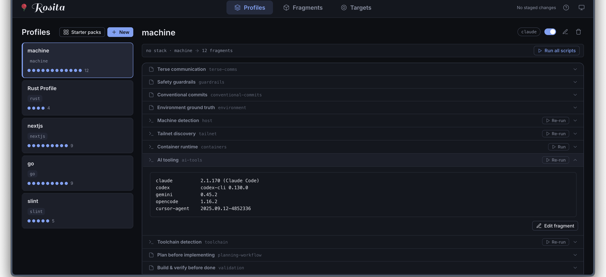

<p align="left">
  
</p>

# Loadout

[](https://github.com/elleryfamilia/loadout/releases)
[](https://github.com/elleryfamilia/loadout/actions/workflows/ci.yml)
[](LICENSE)

**Stop using the same global `AGENTS.md` for every task.**

Loadout is an **adaptive context layer** for AI coding agents. Define reusable context fragments once, then compose them into loadouts that apply based on stack, language, task, or environment. Think *"use this global `AGENTS.md` any time I'm working in Rust, but use this other one when I'm not in a repo at all."*

- Your project's `AGENTS.md` describes **the repo**.
- Loadout describes **the context you bring with you** — across projects, machines, and agent tools.

Works with **Claude, Codex, Gemini, opencode, and Copilot**. Loadout delivers your context as a local, gitignored file each agent reads — without touching committed project instruction files.

<p align="center">
  
</p>
<p align="center"><sub><i><code>load studio</code> — compose reusable context loadouts from your fragment library.</i></sub></p>

---

## Why Loadout?

Most AI tools give you either one global context file or repo-specific instruction files. Loadout adds the missing layer in between: reusable context that adapts to the stack, language, task, or environment you're working in.

Use it when you want to:

* stop maintaining one giant global instruction file
* reuse guidance across Claude, Codex, Gemini, opencode, and Copilot
* apply different context for coding, debugging, DevOps, or sysadmin work
* keep personal/global context outside committed project files
* sync agent context across laptops, servers, VMs, and containers
* inspect exactly what context an agent will receive before launching it

---

## Quick start

Install the prebuilt binary — no Rust toolchain needed:

```bash
curl -LsSf https://github.com/elleryfamilia/loadout/releases/latest/download/loadout-installer.sh | sh
```

Open the local UI and create your first fragments and loadouts:

```bash
load studio
```

Run your agent with the matching context injected — just `load <agent>`:

```bash
load claude
```

More options — source builds, self-updating — in [Install](#install).

---

## What happens?

Loadout detects the current context, selects the matching loadout, and renders the selected fragments into a local, gitignored file — the **overlay** — which it wires into your agent.

```bash
$ load explain

Project
  base   : ~/code/my-rust-app
  branch : main

Detected targets: [rust]

Loadout selection → rust

Active fragments
  • rust-conventions
  • terse-comms

Write plan
  claude:
    created  .loadout/generated/claude.md
    updated  CLAUDE.local.md
```

Then launch the agent:

```bash
$ load claude
```

Loadout renders the overlay, wires it into Claude, and starts `claude`.

The repo itself gains no committed Loadout content. Generated overlays, local bindings, logs, and managed local files stay gitignored.

<p align="center">
  
</p>

---

## The model in 60 seconds

Loadout has three things you author and one rule for putting them together.

### Fragments

Reusable units of guidance or context.

Examples:

* `rust-conventions`
* `nextjs-preferences`
* `terse-comms`
* `infrastructure-safety`
* `workspace-status`
* `running-containers`

Fragments can be static guidance or dynamic context from providers and shell commands.

### Loadouts

Named bundles of fragments, tied to one or more targets. A loadout is the unit of selection: when its targets match, its fragment list is what gets rendered. See the [worked example](#a-worked-example) below.

### Targets

Targets are the coarse project or environment types Loadout detects.

Built-in targets include:

```text
rust
node
bun
nextjs
go
python
java
ruby
php
swift
dotnet
machine
```

`machine` applies when you are not inside a repo, which is useful for sysadmin, DevOps, and machine-level work.

### The rule

Loadout selects one loadout per context.

Loadouts do not merge or stack. Composition happens inside the chosen loadout, through its fragment list.

```text
no loadout's targets match  →  a no-targets default loadout applies, else empty
exactly one loadout matches →  use it automatically
multiple loadouts match     →  ask once, then remember the binding for this project
```

Selection is deterministic and inspectable:

```bash
load explain
```

No LLM is involved in loadout selection. The agent only receives the finished overlay.

---

## A worked example

Create a `rust` loadout once, globally:

```toml
[[fragments]]
id = "rust-conventions"
guidance = "Build with cargo, lint with clippy; prefer ?/Result over unwrap()."

[[fragments]]
id = "terse-comms"
guidance = "Be terse: lead with the result and what changed; skip preamble."

[[loadouts]]
name = "rust"
targets = ["rust"]
fragments = ["rust-conventions", "terse-comms"]
```

Move into any Rust repo:

```bash
cd ~/code/my-rust-app
load explain
```

Loadout detects the target and selects the matching loadout:

```text
Detected targets: [rust]
Loadout selection → rust

Active fragments
  • rust-conventions
  • terse-comms
```

Render the overlay for Claude:

```bash
load refresh --agent claude
```

Output:

```text
claude  ·  loadout rust  ·  sha256:a1fb087e1a81…
  created  .loadout/generated/claude.md
  created  CLAUDE.local.md
  created  .gitignore
```

Or render and launch in one step:

```bash
load run claude
```

The repo itself gains no committed Loadout content — only a gitignored overlay and, if needed, a gitignored binding that remembers which loadout to use here.

---

## Where everything lives

You author fragments and loadouts once, globally. A repo never stores them — it only remembers which loadout to use.

<p align="center">
  
</p>

A read-only **palette** of starter fragments also ships inside the binary. You duplicate a starter into your library to own and edit it; palette entries are never auto-composed.

### Global config

Your reusable library lives in:

```text
~/.config/loadout/config.toml
~/.config/loadout/local.toml
```

`config.toml` is public/shareable.

`local.toml` is private and gitignored. Use it for hostnames, host classes, and machine-specific values.

### Repo-local state

A repo may contain:

```text
.loadout/generated/
.loadout/local.toml
.loadout/logs/
.loadout/cache/
```

These are gitignored. They hold generated overlays, local loadout bindings, logs, and caches.

Repos do not store global fragments or loadouts. If a repo declares them, `load doctor` flags it.

---

## `load studio`

`load studio` opens a localhost-only web UI for managing your fragment and loadout library.

```bash
load studio
```

Studio is a visual editor over your TOML config files. It is not a hidden database.

Use it to:

* create and edit fragments
* compose loadouts
* assign loadouts to targets
* preview generated overlays
* run dynamic fragment previews
* review diffs before applying changes

Nothing touches disk until you review and apply the staged diff.

On first launch, Studio detects your current context and can scaffold a starter loadout from the detected target.

---

## Sync across machines

Because fragments and loadouts are global-only, sharing them across machines is just syncing your global config.

On your main machine:

```bash
load sync init
```

Or wire it to an existing repo:

```bash
load sync init git@github.com:you/loadout-config.git
```

On another machine:

```bash
load sync clone https://github.com/you/loadout-config.git
```

After that, `load run` pulls the latest config before rendering.

```text
⟳ sync    pulled 2 changes · loadout-config  1.3s
✓ render  rust → claude · sha256:a1fb087…
▸ launch  claude
```

`local.toml` stays private and does not sync.

---

## Already have a `CLAUDE.md` or `AGENTS.md`?

Do not hand-translate it.

Loadout ships an agent skill called [`loadout-migrate`](skills/loadout-migrate/SKILL.md). It reads your existing global agent instructions and turns them into Loadout fragments plus the loadouts you need. Your originals are left untouched.

The skills follow the cross-agent Agent Skills format (`SKILL.md`), so the same install works in Claude Code, Codex CLI, Gemini CLI, and opencode.

Install the skills:

```bash
load skill install
```

Then in an agent session:

```text
/loadout-migrate
```

Or ask:

```text
Import my CLAUDE.md into Loadout.
```

Loadout also ships [`loadout-remember`](skills/loadout-remember/SKILL.md). When you tell your agent a durable, cross-project preference mid-session, the skill can save it as a Loadout fragment instead of leaving it stranded in one agent's local memory.

Example:

```text
Always lead with the answer before explaining.
```

That kind of durable preference can become reusable Loadout context.

Project-specific or session-specific notes should stay in the agent's own memory.

---

## Supported agents

Loadout produces one overlay and delivers it differently depending on the agent.

| Agent      | Loadout writes                                                            | Default wiring                                                 |
| ---------- | ------------------------------------------------------------------------ | -------------------------------------------------------------- |
| `claude`   | `.loadout/generated/claude.md`                                            | Adds a managed import block to `CLAUDE.local.md`               |
| `codex`    | `.loadout/generated/agents.md`                                            | Merges into gitignored `AGENTS.override.md`                    |
| `gemini`   | `.loadout/generated/gemini.md`                                            | Wires through gitignored `GEMINI.local.md` and Gemini settings |
| `opencode` | `.loadout/generated/opencode.md`                                          | Registers the overlay in global opencode instructions          |
| `copilot`  | `.loadout/generated/copilot/.github/instructions/loadout.instructions.md`  | Launches Copilot CLI with the custom instructions directory    |
| `generic`  | `.loadout/generated/generic.md`                                           | Emit-only; you wire it yourself                                 |

Loadout never edits committed shared instruction files like:

```text
AGENTS.md
CLAUDE.md
GEMINI.md
.github/copilot-instructions.md
```

It uses local and gitignored paths instead.

---

## What gets detected?

`load detect` exposes:

* current working directory
* git root, branch, remotes, and worktree state
* repo name
* languages by extension
* stack, such as Rust, Next.js, Node, Go, Python
* package manager, such as cargo, pnpm, yarn, npm, bun, uv, poetry, pip
* discovered build, test, lint, and run commands
* OS, architecture, hostname, and user
* parent process
* allowlisted and redacted environment variables

Use:

```bash
load detect
```

For provider details:

```bash
load detect --probes
```

The coarse detected stack is what loadout `targets` match against.

---

## Dynamic fragments

Fragments can include live environment context through built-in providers or shell commands.

Example:

```toml
[[fragments]]
id = "containers"
provider = "docker"
cache = "30s"
guidance = "Running containers as of {{ generated_at }}:\n{{ provider.output }}"
```

A command-backed fragment can also run at render time:

```toml
[[fragments]]
id = "workspace-status"
command = "git status --short"
cache = "10s"
guidance = "Current git status:\n{{ provider.output }}"
```

Dynamic output is redacted, cached, and written only to the gitignored overlay.

Because fragments are global-only, a cloned repo cannot introduce one.

---

## Safety model

Generated overlays are agent guidance, not enforced policy.

Loadout helps keep generated context clean and local, but the files are still regular files an agent reads.

Safety and hygiene features include:

* allowlisted environment variables only
* denylist filtering for secret-like names
* redaction for common token formats and embedded credentials
* atomic writes
* gitignored generated artifacts
* managed marker blocks
* context hashes for idempotent rendering
* `--dry-run` previews
* `load doctor` diagnostics

Treat generated files as guidance, not a security boundary.

---

## Commands

| Command                                                                     | What it does                                                                |
| --------------------------------------------------------------------------- | --------------------------------------------------------------------------- |
| `load <agent> [args…]`                                                    | Equip the matching loadout and launch the agent (e.g. `load claude`)        |
| `load run <agent> [args…] [--skip-render] [--override\|--no-override]`    | Explicit form of `load <agent>`                                             |
| `load use <loadout>`                                                      | Pin this project to a loadout (remembers the choice)                        |
| `load list [loadouts\|fragments\|agents\|targets] [--json]`              | List loadouts (default), fragments, agents, or targets                      |
| `load edit [name]`                                                        | Open your config in `$EDITOR` to edit a loadout or fragment                 |
| `load studio [--port N] [--no-open]`                                      | Launch the local web UI for fragments and loadouts                          |
| `load explain [--agent <id>\|all] [--json]`                              | Show detected context, matching loadouts, selected loadout, and write plan  |
| `load refresh [--agent <id>\|all] [--override\|--no-override] [--force]` | Pull latest config, then render or re-render overlays without launching     |
| `load clean [--agent <id>\|all]`                                         | Remove generated overlays and managed blocks                                |
| `load detect [--json] [--probes]`                                        | Print detected context and optional provider data                          |
| `load doctor`                                                            | Diagnose config, agents, templates, overlays, and safety issues            |
| `load sync [init [url] \| clone <url>]`                                  | Sync global config across machines                                         |
| `load skill [install\|remove\|status] [id]`                              | Manage embedded agent skills (installed under `~/.agents/skills`)          |
| `load update [--check]`                                                  | Self-update installer-based installs                                       |

Built-in agent IDs:

```text
claude
codex
gemini
opencode
copilot
generic
```

Global flags:

```text
--cwd <path>
--verbose
--dry-run
```

---

## Configuration

Fragments and loadouts are global-only.

They live in:

```text
~/.config/loadout/config.toml
~/.config/loadout/local.toml
```

Basic example:

```toml
[[fragments]]
id = "nextjs-preferences"
guidance = """
Prefer server components by default.
Use TypeScript.
Avoid unnecessary client state.
Run the existing lint/test commands before claiming completion.
"""

[[fragments]]
id = "review-style"
guidance = """
Be concise.
Lead with the result.
Call out risky assumptions.
Prefer diffs over full-file rewrites.
"""

[[loadouts]]
name = "nextjs"
targets = ["nextjs"]
fragments = ["nextjs-preferences", "review-style"]
```

Within the selected loadout, fragments are composed, deduped by ID, dependency-resolved, self-gated with `when` rules, and rendered into the agent overlay.

Loadouts select on `targets`.

Fragments can self-gate with `when` rules for narrower conditions, such as stack, language, package manager, path, branch, repo, host class, OS, or architecture.

---

## Templates

Loadout renders Markdown overlays using templates.

The template model includes:

* `context`
* `loadout`
* `loadout_guidance`
* `agent`

Generated files include a header with:

* generation timestamp
* selected loadout
* context hash
* source config files
* "do not edit" warning

You can use the defaults or override templates when needed.

---

## Staleness and freshness

Overlays are point-in-time snapshots.

Each overlay includes a self-healing banner with the host, timestamp, selected loadout, context hash, and commands to verify, regenerate, or remove it.

```bash
load doctor
load refresh
load clean
```

`load run` re-renders before launching the agent.

---

## Audit

Every render appends a JSON line to:

```text
.loadout/logs/events.jsonl
```

The audit log records:

* selected agent
* selected loadout
* detected stacks
* files written
* match reasons
* context hash
* dry-run status

---

## Install

Prebuilt binary — no Rust toolchain needed:

```bash
curl -LsSf https://github.com/elleryfamilia/loadout/releases/latest/download/loadout-installer.sh | sh
```

Builds are published for macOS and Linux.

Windows is not built yet. Use WSL.

Installer-based installs can update in place:

```bash
load update
```

From source:

```bash
cargo install --git https://github.com/elleryfamilia/loadout
```

For local development:

```bash
git clone https://github.com/elleryfamilia/loadout
cd loadout
cargo install --path .
```

---

## Testing

```bash
cargo test
cargo clippy --all-targets
cargo fmt --check
```

---

## Documentation

Full docs live in [`docs/`](docs/):

* [Concepts](docs/concepts.md)
* [Configuration](docs/configuration.md)
* [Security & trust](docs/security.md)
* [Architecture](docs/architecture.md)
* [Extending](docs/extending.md)
* [Testing](docs/testing.md)

---

## License

Licensed under the [MIT License](LICENSE).

Unless you explicitly state otherwise, any contribution you submit for inclusion shall be licensed as above, without additional terms.
