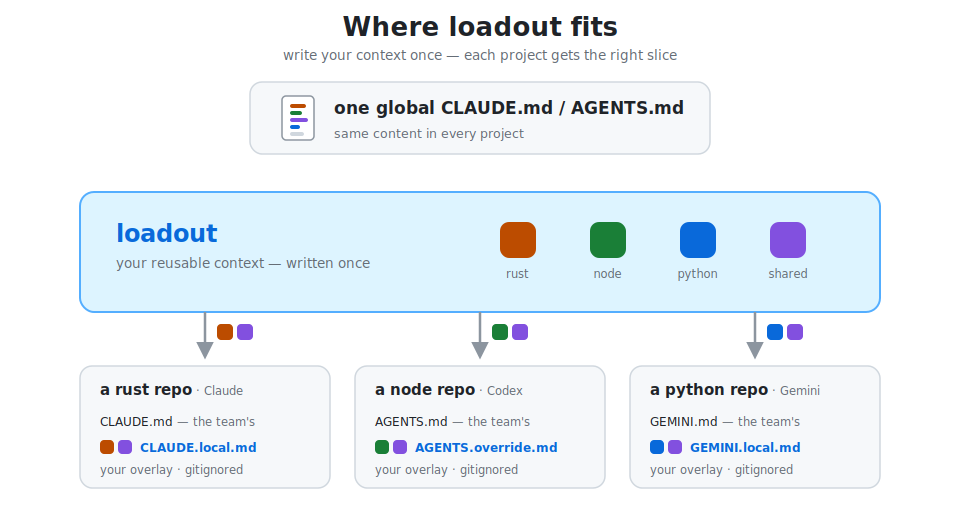

<p align="left">
  
</p>

# Rosita

Stop using the same global `AGENTS.md` for every task.

Rosita is an adaptive context layer for AI coding agents. Define reusable context once, then apply the right profile based on the stack, language, task, or environment you're working in.

Your project's `AGENTS.md` describes the repo. Rosita describes the context you want to bring with you across projects, machines, and agent tools.

Rosita works with Claude, Codex, Gemini, opencode, Copilot, and generic Markdown-based agent flows. It renders gitignored overlays and wires them into each agent without touching committed project instruction files.

<p align="center">
  
</p>
<p align="center"><sub><i><code>rosita studio</code> — compose reusable context profiles from your fragment library.</i></sub></p>

---

## Why Rosita?

Most AI tools give you either one global context file or repo-specific instruction files.

Rosita adds the missing layer in between: reusable context that adapts to the stack, language, task, or environment you're working in.

<p align="center">
  
</p>

Use it when you want to:

* stop maintaining one giant global instruction file
* reuse guidance across Claude, Codex, Gemini, opencode, and Copilot
* apply different context for coding, debugging, DevOps, or sysadmin work
* keep personal/global context outside committed project files
* sync agent context across laptops, servers, VMs, and containers
* inspect exactly what context an agent will receive before launching it

---

## Quick start

Install the prebuilt binary — no Rust toolchain needed:

```bash
curl -LsSf https://github.com/elleryfamilia/rosita/releases/latest/download/rosita-installer.sh | sh
```

Open the local UI and create your first fragments and profiles:

```bash
rosita studio
```

See what Rosita detects in the current project:

```bash
rosita explain
```

Run your agent with the matching context injected:

```bash
rosita run claude
```

More options — source builds, self-updating — in [Install](#install).

---

## What happens?

Rosita detects the current context, selects the matching profile, renders the selected fragments, and wires the result into your agent through a local, gitignored overlay.

```bash
$ rosita explain

Project
  base   : ~/code/my-rust-app
  branch : main

Detected targets: [rust]

Profile selection → rust

Active fragments
  • rust-conventions
  • terse-comms

Write plan
  claude:
    created  .rosita/generated/claude.md
    updated  CLAUDE.local.md
```

Then launch the agent:

```bash
$ rosita run claude
```

Rosita renders the overlay, wires it into Claude, and starts `claude`.

The repo itself gains no committed Rosita content. Generated overlays, local bindings, logs, and managed local files stay gitignored.

<p align="center">
  
</p>

---

## The model in 60 seconds

Rosita has three things you author and one rule for putting them together.

### Fragments

Reusable units of guidance or context.

Examples:

* `rust-conventions`
* `nextjs-preferences`
* `terse-comms`
* `infrastructure-safety`
* `workspace-status`
* `running-containers`

Fragments can be static guidance or dynamic context from providers and shell commands.

### Profiles

Named bundles of fragments, tied to one or more targets. A profile is the unit of selection: when its targets match, its fragment list is what gets rendered. See the [worked example](#a-worked-example) below.

### Targets

Targets are the coarse project or environment types Rosita detects.

Built-in targets include:

```text
rust
node
nextjs
go
python
java
ruby
php
swift
dotnet
machine
```

`machine` applies when you are not inside a repo, which is useful for sysadmin, DevOps, and machine-level work.

### The rule

Rosita selects one profile per context.

Profiles do not merge or stack. Composition happens inside the chosen profile, through its fragment list.

```text
no profile's targets match  →  a no-targets default profile applies, else empty
exactly one profile matches →  use it automatically
multiple profiles match     →  ask once, then remember the binding for this project
```

Selection is deterministic and inspectable:

```bash
rosita explain
```

No LLM is involved in profile selection. The agent only receives the finished overlay.

---

## A worked example

Create a `rust` profile once, globally:

```toml
[[fragments]]
id = "rust-conventions"
guidance = "Build with cargo, lint with clippy; prefer ?/Result over unwrap()."

[[fragments]]
id = "terse-comms"
guidance = "Be terse: lead with the result and what changed; skip preamble."

[[profiles]]
name = "rust"
targets = ["rust"]
fragments = ["rust-conventions", "terse-comms"]
```

Move into any Rust repo:

```bash
cd ~/code/my-rust-app
rosita explain
```

Rosita detects the target and selects the matching profile:

```text
Detected targets: [rust]
Profile selection → rust

Active fragments
  • rust-conventions
  • terse-comms
```

Render the overlay for Claude:

```bash
rosita refresh --agent claude
```

Output:

```text
claude  ·  profile rust  ·  sha256:a1fb087e1a81…
  created  .rosita/generated/claude.md
  created  CLAUDE.local.md
  created  .gitignore
```

Or render and launch in one step:

```bash
rosita run claude
```

The repo itself gains no committed Rosita content — only a gitignored overlay and, if needed, a gitignored binding that remembers which profile to use here.

---

## Where everything lives

You author fragments and profiles once, globally. A repo never stores them — it only remembers which profile to use.

<p align="center">
  
</p>

A read-only **palette** of starter fragments also ships inside the binary. You duplicate a starter into your library to own and edit it; palette entries are never auto-composed.

### Global config

Your reusable library lives in:

```text
~/.config/rosita/config.toml
~/.config/rosita/local.toml
```

`config.toml` is public/shareable.

`local.toml` is private and gitignored. Use it for hostnames, host classes, and machine-specific values.

### Repo-local state

A repo may contain:

```text
.rosita/generated/
.rosita/local.toml
.rosita/logs/
.rosita/cache/
```

These are gitignored. They hold generated overlays, local profile bindings, logs, and caches.

Repos do not store global fragments or profiles. If a repo declares them, `rosita doctor` flags it.

---

## `rosita studio`

`rosita studio` opens a localhost-only web UI for managing your fragment and profile library.

```bash
rosita studio
```

Studio is a visual editor over your TOML config files. It is not a hidden database.

Use it to:

* create and edit fragments
* compose profiles
* assign profiles to targets
* preview generated overlays
* run dynamic fragment previews
* review diffs before applying changes

Nothing touches disk until you review and apply the staged diff.

On first launch, Studio detects your current context and can scaffold a starter profile from the detected target.

---

## Sync across machines

Because fragments and profiles are global-only, sharing them across machines is just syncing your global config.

On your main machine:

```bash
rosita sync init
```

Or wire it to an existing repo:

```bash
rosita sync init git@github.com:you/rosita-config.git
```

On another machine:

```bash
rosita sync clone https://github.com/you/rosita-config.git
```

After that, `rosita run` pulls the latest config before rendering.

```text
⟳ sync    pulled 2 changes · rosita-config  1.3s
✓ render  rust → claude · sha256:a1fb087…
▸ launch  claude
```

`local.toml` stays private and does not sync.

---

## Already have a `CLAUDE.md` or `AGENTS.md`?

Do not hand-translate it.

Rosita ships an agent skill called [`rosita-migrate`](skills/rosita-migrate/SKILL.md). It reads your existing global agent instructions and turns them into Rosita fragments plus the profiles you need. Your originals are left untouched.

The skills follow the cross-agent Agent Skills format (`SKILL.md`), so the same install works in Claude Code, Codex CLI, Gemini CLI, and opencode.

Install the skills:

```bash
rosita skill install
```

Then in an agent session:

```text
/rosita-migrate
```

Or ask:

```text
Import my CLAUDE.md into Rosita.
```

Rosita also ships [`rosita-remember`](skills/rosita-remember/SKILL.md). When you tell your agent a durable, cross-project preference mid-session, the skill can save it as a Rosita fragment instead of leaving it stranded in one agent's local memory.

Example:

```text
Always lead with the answer before explaining.
```

That kind of durable preference can become reusable Rosita context.

Project-specific or session-specific notes should stay in the agent's own memory.

---

## Supported agents

Rosita produces one overlay and delivers it differently depending on the agent.

| Agent      | Rosita writes                                                            | Default wiring                                                 |
| ---------- | ------------------------------------------------------------------------ | -------------------------------------------------------------- |
| `claude`   | `.rosita/generated/claude.md`                                            | Adds a managed import block to `CLAUDE.local.md`               |
| `codex`    | `.rosita/generated/agents.md`                                            | Merges into gitignored `AGENTS.override.md`                    |
| `gemini`   | `.rosita/generated/gemini.md`                                            | Wires through gitignored `GEMINI.local.md` and Gemini settings |
| `opencode` | `.rosita/generated/opencode.md`                                          | Registers the overlay in global opencode instructions          |
| `copilot`  | `.rosita/generated/copilot/.github/instructions/rosita.instructions.md`  | Launches Copilot CLI with the custom instructions directory    |
| `generic`  | `.rosita/generated/generic.md`                                           | Emit-only; you wire it yourself                                 |

Rosita never edits committed shared instruction files like:

```text
AGENTS.md
CLAUDE.md
GEMINI.md
.github/copilot-instructions.md
```

It uses local and gitignored paths instead.

---

## What gets detected?

`rosita detect` exposes:

* current working directory
* git root, branch, remotes, and worktree state
* repo name
* languages by extension
* stack, such as Rust, Next.js, Node, Go, Python
* package manager, such as cargo, pnpm, yarn, npm, bun, uv, poetry, pip
* discovered build, test, lint, and run commands
* OS, architecture, hostname, and user
* parent process
* allowlisted and redacted environment variables

Use:

```bash
rosita detect
```

For provider details:

```bash
rosita detect --probes
```

The coarse detected stack is what profile `targets` match against.

---

## Dynamic fragments

Fragments can include live environment context through built-in providers or shell commands.

Example:

```toml
[[fragments]]
id = "containers"
provider = "docker"
cache = "30s"
guidance = "Running containers as of {{ generated_at }}:\n{{ provider.output }}"
```

A command-backed fragment can also run at render time:

```toml
[[fragments]]
id = "workspace-status"
command = "git status --short"
cache = "10s"
guidance = "Current git status:\n{{ provider.output }}"
```

Dynamic output is redacted, cached, and written only to the gitignored overlay.

Because fragments are global-only, a cloned repo cannot introduce one.

---

## Safety model

Generated overlays are agent guidance, not enforced policy.

Rosita helps keep generated context clean and local, but the files are still regular files an agent reads.

Safety and hygiene features include:

* allowlisted environment variables only
* denylist filtering for secret-like names
* redaction for common token formats and embedded credentials
* atomic writes
* gitignored generated artifacts
* managed marker blocks
* context hashes for idempotent rendering
* `--dry-run` previews
* `rosita doctor` diagnostics

Treat generated files as guidance, not a security boundary.

---

## Commands

| Command                                                                     | What it does                                                                |
| --------------------------------------------------------------------------- | --------------------------------------------------------------------------- |
| `rosita studio [--port N] [--no-open]`                                      | Launch the local web UI for fragments and profiles                          |
| `rosita sync [init [url] \| clone <url>]`                                   | Sync global config across machines                                          |
| `rosita detect [--json] [--probes]`                                         | Print detected context and optional provider data                           |
| `rosita explain [--agent <id>\|all] [--json]`                               | Show detected context, matching profiles, selected profile, and write plan  |
| `rosita run <id> [args…] [--skip-render] [--override\|--no-override]`       | Pull latest config, render context, then launch the agent                   |
| `rosita refresh [--agent <id>\|all] [--override\|--no-override] [--force]`  | Pull latest config, then render or re-render overlays without launching     |
| `rosita clean [--agent <id>\|all]`                                          | Remove generated overlays and managed blocks                                |
| `rosita doctor`                                                             | Diagnose config, agents, templates, overlays, and safety issues             |
| `rosita fragments [list\|show <id>] [--json]`                               | Inspect your fragment library                                               |
| `rosita profiles [--json]`                                                  | List profiles, targets, matches, and selected profile                       |
| `rosita agents [--json]`                                                    | List configured agents and delivery behavior                                |
| `rosita skill [install\|remove\|status] [id]`                               | Manage embedded agent skills (installed under `~/.agents/skills`)           |
| `rosita update [--check]`                                                   | Self-update installer-based installs                                        |

Built-in agent IDs:

```text
claude
codex
gemini
opencode
copilot
generic
```

Global flags:

```text
--cwd <path>
--verbose
--dry-run
```

---

## Configuration

Fragments and profiles are global-only.

They live in:

```text
~/.config/rosita/config.toml
~/.config/rosita/local.toml
```

Basic example:

```toml
[[fragments]]
id = "nextjs-preferences"
guidance = """
Prefer server components by default.
Use TypeScript.
Avoid unnecessary client state.
Run the existing lint/test commands before claiming completion.
"""

[[fragments]]
id = "review-style"
guidance = """
Be concise.
Lead with the result.
Call out risky assumptions.
Prefer diffs over full-file rewrites.
"""

[[profiles]]
name = "nextjs"
targets = ["nextjs"]
fragments = ["nextjs-preferences", "review-style"]
```

Within the selected profile, fragments are composed, deduped by ID, dependency-resolved, self-gated with `when` rules, and rendered into the agent overlay.

Profiles select on `targets`.

Fragments can self-gate with `when` rules for narrower conditions, such as stack, language, package manager, path, branch, repo, host class, OS, or architecture.

---

## Templates

Rosita renders Markdown overlays using templates.

The template model includes:

* `context`
* `profile`
* `profile_guidance`
* `agent`

Generated files include a header with:

* generation timestamp
* selected profile
* context hash
* source config files
* "do not edit" warning

You can use the defaults or override templates when needed.

---

## Staleness and freshness

Overlays are point-in-time snapshots.

Each overlay includes a self-healing banner with the host, timestamp, selected profile, context hash, and commands to verify, regenerate, or remove it.

```bash
rosita doctor
rosita refresh
rosita clean
```

`rosita run` re-renders before launching the agent.

---

## Audit

Every render appends a JSON line to:

```text
.rosita/logs/events.jsonl
```

The audit log records:

* selected agent
* selected profile
* detected stacks
* files written
* match reasons
* context hash
* dry-run status

---

## Install

Prebuilt binary — no Rust toolchain needed:

```bash
curl -LsSf https://github.com/elleryfamilia/rosita/releases/latest/download/rosita-installer.sh | sh
```

Builds are published for macOS and Linux.

Windows is not built yet. Use WSL.

Installer-based installs can update in place:

```bash
rosita update
```

From source:

```bash
cargo install --git https://github.com/elleryfamilia/rosita
```

For local development:

```bash
git clone https://github.com/elleryfamilia/rosita
cd rosita
cargo install --path .
```

---

## Testing

```bash
cargo test
cargo clippy --all-targets
cargo fmt --check
```

---

## Documentation

Full docs live in [`docs/`](docs/):

* [Concepts](docs/concepts.md)
* [Configuration](docs/configuration.md)
* [Security & trust](docs/security.md)
* [Architecture](docs/architecture.md)
* [Extending](docs/extending.md)
* [Testing](docs/testing.md)

---

## License

Licensed under the [MIT License](LICENSE).

Unless you explicitly state otherwise, any contribution you submit for inclusion shall be licensed as above, without additional terms.
